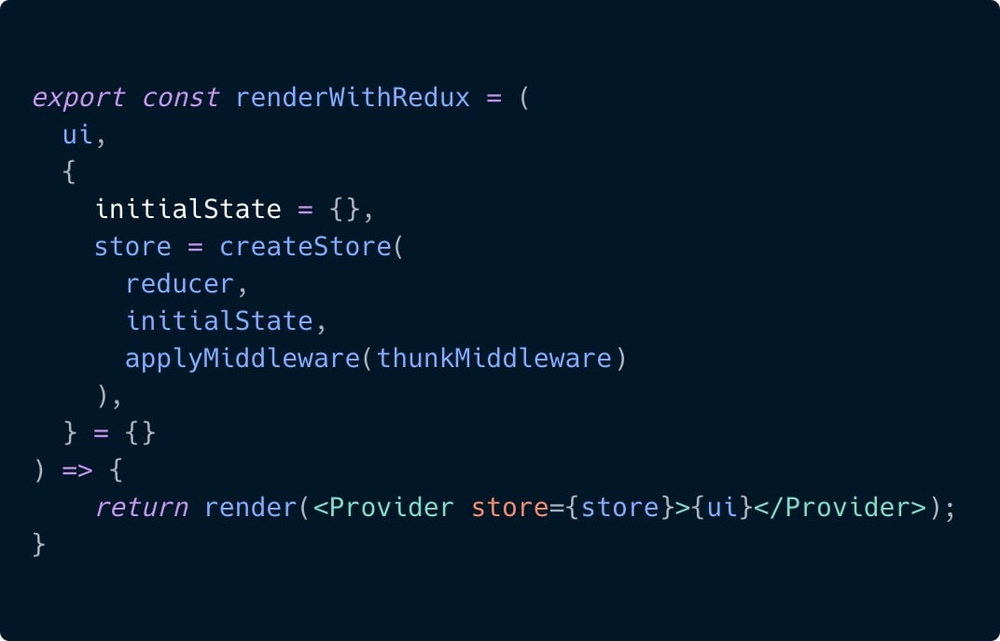

Browsing multiple projects, I encountered a recurring pattern when trying to write a custom render for components that use Providers (React-Redux’s `Provider`, React-Intl’s `IntlProvider` for example).  
This pattern usually looks like this:



This function is nice. It creates a utility that lets us call it whenever we want to test a connected component. The only problem is, it’s limited and causes an inconsistent behavior.  
Usually, our app will work with several `Providers`, not only one, and this solution becomes squeaky when we try to add more `Providers` to it.  
Another thing is that using it will cause inconsistency since we will call `renderWithRedux` every time instead of calling `render` as we usually do and we will also import the `renderWithRedux` from our test-utils file and all the other RTL utils like `screen` and `fireEvent` from `@testing-library/react`.  
We will probably get something like this:

```jsx
// This looks bad
import { renderWithRedux } from "./test-utils"
import { screen } from "@testing-library/react"

test("Can render with Redux", () => {
    renderWithRedux(<ConnectedComponent />, {
        initialState: { value: "2019-03-11" },
    })
})
```

To fix this, React Testing Library lets us create a custom `render` function.  
I have to be clear. This functionality isn’t new, it’s just not well known or used (in most of the projects I’ve seen lately).  
To create a custom `render` function, we don’t have to work hard.

```jsx
const customRender = (
    ui,
    {
        initialState = reducerInitialState,
        store = createStore(reducer, initialState),
        theme = defaultTheme,
        locale = defaultLocale,
        ...renderOptions
    }
) => {
    function Wrapper({ children }) {
        return (
            <ThemeProvider theme={theme}>
                <IntlProvider locale={locale}>
                    <Provider store={store}>{children}</Provider>
                </IntlProvider>
            </ThemeProvider>
        )
    }

    return rtlRender(ui, { wrapper: Wrapper, ...renderOptions })
}

// re-export everything
export * from "@testing-library/react"

// override render method
export { customRender as render }
```

By doing this, we’ve created a function that uses the `Wrapper` option of RTL’s `render`. On top of it all, we also exported all the other functionalities so now we can import our `render` function and all the other React Testing Library functionality (`fireEvent` , `screen` etc.) from the same place.

Let’s take an example of a simple connected, translated, styled date component (This is an imaginary use case 😅):

```jsx
import { render, screen } from "./test-utils"
import "@testing-library/jest-dom/extend-expect"
import ConnectedDateComponent from "./ConnectedDateComponent"

test("Can render with redux with custom initial state", () => {
    render(<ConnectedDateComponent />, {
        initialState: { value: "2019-03-11" },
        locale: "he-IL",
        theme: { background: "black" },
    })

    expect(screen.getByTestId('date-display')).toHaveTextContent('11/03/2019')
})
```

We can see that I imported `render` and `screen` from our test utils, and this test is actually using all of our `Providers`: `ThemeProvider`, React-Redux’s `Provider` and `IntlProvider`.

That’s it! I hope I made everything clear.  
If you have any questions, feel free to ask.  
I’m available on [twitter](https://twitter.com/matanbobi).  
Thanks for reading!
