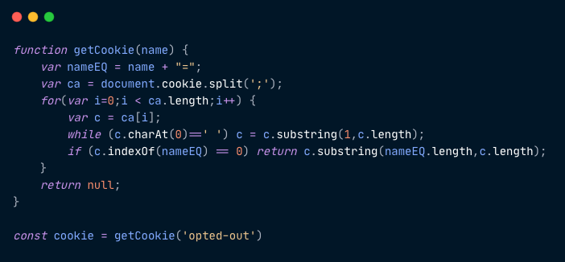
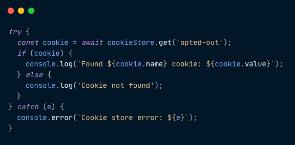
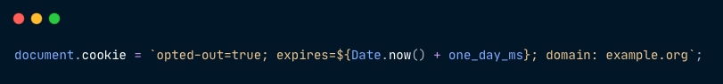
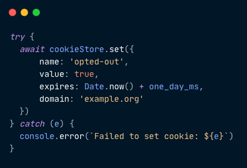
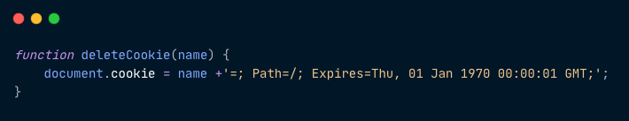
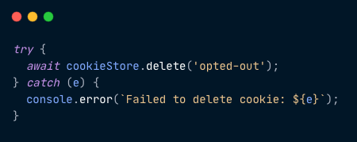
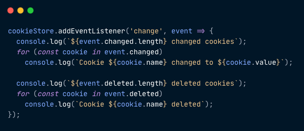

> *TLDR:*  
> *The Cookie Store API is a new browser API built to expose cookies to service worker and offer an asynchronous alternative to document.cookie. It’s available in Chrome Browser starting from version 87.*

Are you sick and tired of weird ways to get cookies from`document.cookie` ? Hate it that you don’t know whether the cookie you set was actually saved or not? Introducing: Cookie Store API, available on Chrome version 87!

## Motivation
We all use HTTP Cookies almost daily, but working with them was never an easy task.  
The cookies interface is overly complexed and contains performance issues. Saving all of the cookies in `document.cookie` which is part of the Document Object Model from October 2000, seems like a pattern that doesn’t correspond to the javascript we write these days.

The Cookie Store API aims to improve this by providing an asynchronous alternative to `document.cookie` and exposing HTTP cookies to service workers, which will also benefit performance. It’s available on Chrome Browser starting from version 87 but still didn’t land in any other major browsers.

## Get Cookies
Getting a cookie always looked odd to me. Why do I have a full string containing all of the cookies? Getting a specific cookie always seems like an over-complex solution, using some regex or looping over the `document.cookie` value. In fact, all of us who need cookies probably have this util taken from some [StackOverflow answer](https://stackoverflow.com/a/24103596/4232673) in their codebase:

In the new way, all we need to do is use the `cookieStore` object and call its `get` function. Don’t forget that this returns a promise so you `await` for its result and if something wrong happened, it would throw an error:

No more looping over a cookies string! Amazing!

## Set Cookie
Don’t you just hate setting a cookie? The API seems so old-fashioned.

Following what we wrote about getting cookies, the `setCookie` util probably looks somewhat like this:

After doing that, we’d probably also want to know that the cookie was successfully created. So we’ll use the `getCookie` util from before and loop over the cookies string to find that cookie.

In the new API, what you’ll need to do is use the `cookieStore` object and call the `set` function with the params, that’s all.

After calling that function, as long as we didn’t get to the `catch` block, we can be 100% sure that the cookie was saved successfully, and we don’t need to loop over anything or call `cookieStore.get` to see that it was saved.

## Delete Cookies
To delete the cookie, we probably had something similar to this util:

It will basically set the cookie date to an old date and count on the browser to delete it since it’s already expired.

In the new way, you’ll need to call the `delete` function:

Once again, as long as we didn’t get to the `catch` block, you can 100% be sure that the delete happened.

## Monitoring Cookies
A cool thing you can do with the new `Cookie Store API` is know when the cookie object was changed and act on it:

## Summary
It looks like the Chrome team tackled a problem we took for granted for a long time, and I do believe that this is great progress towards a better web!  
If you’d like to read more, you can visit the [Cookie Store API Draft](https://wicg.github.io/cookie-store/).

I hope everyone’s feeling well and keeping themselves safe!  
If you have any questions, I’m available on [Twitter](https://twitter.com/matanbobi). Feel free to ask or comment, I’d love to hear your feedback!

Thanks,  
Matan.