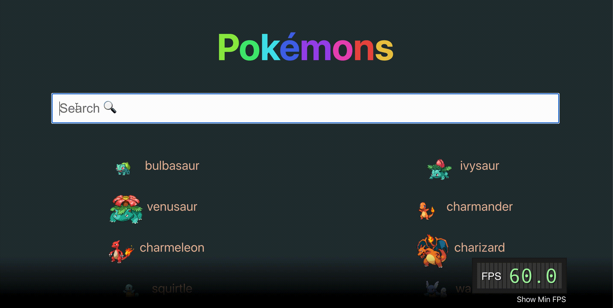
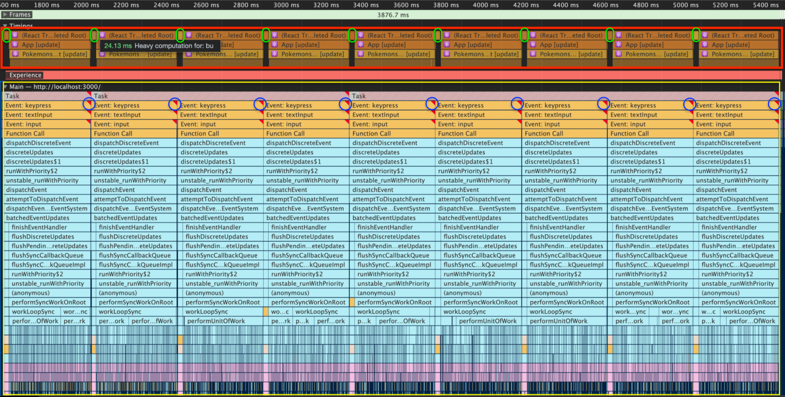
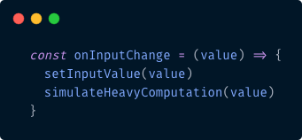
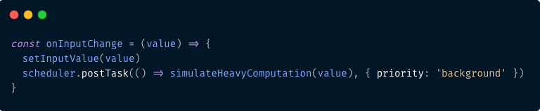
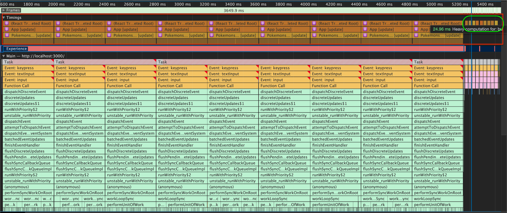
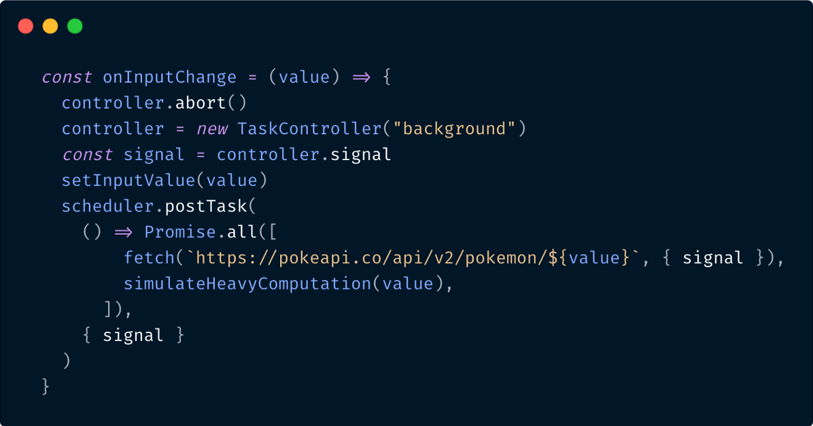
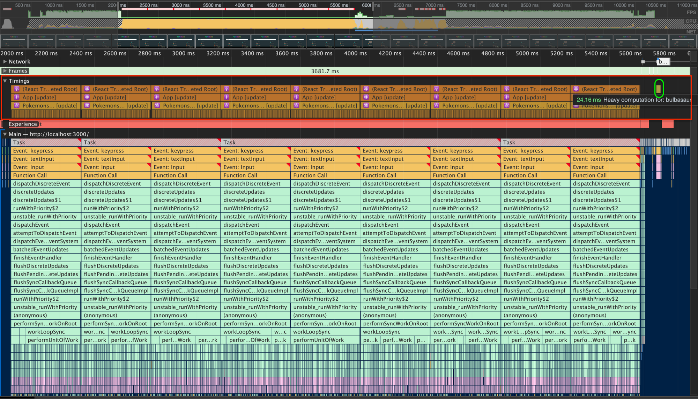

> *TL;DR:*
> *Scheduling is a mechanism introduced lately by the React team to manage and prioritise tasks in the browser. It has become a case study for Google Chrome Dev team, to create a “Main Thread Scheduling” API.  *
> *This is groundbreaking work done by both of the teams. In this article I’ll talk about the APIs, how to use them, and how they will make a difference for our users!*

If you were a part of the Frontend community for the past year and a half, the term “Concurrent” appears in almost every second tweet.  
It all started with [Dan Abramov](https://twitter.com/dan_abramov)’s talk [Beyond React 16](https://reactjs.org/blog/2018/03/01/sneak-peek-beyond-react-16.html) at JSConf Iceland 2018. Dan showed how the React team built a generic way to ensure that high-priority updates don’t get blocked by a low-priority update. The React team called this mechanism “Time Slicing” and it was based on a [Scheduler package](https://www.npmjs.com/package/scheduler) they created.

This scheduler is called the “Userspace Scheduler” and was later used as a case study for Google Chrome developers for their work on a built-in scheduling mechanism.

## The Problem
Let’s take Lin Clark’s analogy from her [talk](https://www.youtube.com/watch?v=ZCuYPiUIONs) in React Conf 2017 and compare our code to a Project Manager. Our project manager has 1 worker, the browser, but our worker is pretty busy, he’s not 100% dedicated to our JavaScript code. It uses one thread to run our code, perform garbage collection, layout, paint, and more.  
This issue buried the main problem: long-running JavaScript functions can block the thread and cause our worker to tip the balance and miss layout, paints, and more. This is a steep slope that immediately leads to an unresponsive page and a bad user experience.

## The Solution
This problem is usually tackled by chunking and scheduling main thread work. In order to keep the browser responsive at all times, you break long tasks to smaller ones and yield back the control to the browser after an appropriate time. The time is calculated based on the current situation of the user and the browser.  
But wait, how will I know to split the work based on time on my own? How do I even yield back control to the browser? 🤔  
To solve these problems we have Userspace Schedulers. So what are they?

**Userspace Scheduler**  
A generic name for JS libraries built-in attempt to chunk up main thread work and schedule it at appropriate times. These libraries are responsible for doing the work and yielding the control back to the browser without blocking the main thread.  
The main goal: Improve responsiveness and maintain high frame-rate.  
The main examples are [React’s Scheduler package](https://www.npmjs.com/package/scheduler) and Google Maps Scheduler.  
These schedulers have been effective in improving responsiveness but they still have some issues, let’s go over them:

1.  Determining when to yield to the browser — Making intelligent decisions of when to yield is difficult with limited knowledge. As a Userspace scheduler, the scheduler is only aware of what’s happening in its own area.  
    The React’s scheduler, for example, defaults to 30 FPS for every unit of work (which means around 1000ms/30=33.333ms) and adjusts it to higher a FPS rate if possible. Having said that, React’s scheduler still checks between frames to see if there’s any user blocking task pending on the main thread and if there is, it yields back control to the browser. React does that by using `scheduling.isInputPending()`, we will talk about this function in the APIs section.
2.  Regaining control after yielding — When regaining control back from the browser, we will have to do the work of the same priority without returning back to the paused task until finishing the other work. That happens because we yield to the event loop and write a callback but there can already be callbacks waiting for that priority.
3.  Coordination between other tasks — Since userspace schedulers don’t control all tasks on the page, their influence is limited. For example, the browser also has tasks to run on the main thread like garbage collection, layout, etc. and userspace schedulers can’t impact these tasks.
4.  Lack of API to schedule chunks of the script — Developers can choose from `setTimeout`, `postMessage`, `requestAnimationFrame`, or `requestIdleCallback`, when choosing to schedule tasks. All of these have a different impact on the event loop and require a thorough knowledge of how it works.  
    The React’s scheduler for example uses `setTimeout` as shown [here](https://github.com/facebook/react/blob/3c7d52c3d6d316d09d5c2479c6851acecccc6325/packages/scheduler/src/forks/SchedulerHostConfig.default.js#L47).

**Main Thread Scheduling API**:  
Since all current solutions have limitations, the Chrome team decided to create API’s for scheduling main thread work. These APIs are all gathered under the “Main-thread Scheduling API” title and are currently an experimental feature not yet deployed to production nor beta version.

## How can we try it?
To get the new Main Thread Scheduling APIs we need Chrome version **82.0.4084.0** and higher.

This version is available in Chrome’s beta version or in Dev and Canary versions. I recommend downloading the Chrome Canary version since it can live alongside our current Chrome version. A download link can be found [here](https://www.google.com/chrome/canary/).  
Once downloaded, we need to turn on the feature-flag called `Experimental web platform APIs` here: `chrome://flags/#enable-experimental-web-platform-features`

## API’s
`scheduler.yield`: When calling this function, we will yield to the event loop, such that a continuation task will run after the user agent services higher priority work, but _before_ tasks of the same priority are allowed to run.  
This function will return a Promise which will be resolved after the event loop services the higher priority work. We will also be able to specify a priority to the function `scheduler.yield(‘high’)` stating we want control after tasks with this priority or higher were executed.

`[scheduling.isInputPending()](https://wicg.github.io/is-input-pending/)`: This function will let us understand whether we have any pending input events waiting in the event loop and in that case we can yield back to the browser so it will handle these input events. This function is [actually being used in React’s Scheduler](https://github.com/facebook/react/blob/3c7d52c3d6d316d09d5c2479c6851acecccc6325/packages/scheduler/src/forks/SchedulerHostConfig.default.js#L127).

`requestPostAnimationFrame`: This API isn’t implemented yet and is more of a draft API. This API will act as a bookend for the `requestAnimationFrame` functionality, an “after paint” callback.  
To understand this — The callback of `requestAnimationFrame` runs just prior to the rendering and the callback of `requestPostAnimationFrame` will run _immediately_ after the rendering. This can be used to get a head-start on long running task and starting to create the next frame as soon as possible.

`TaskController`: This API is the main API for controlling tasks, it contains a signal object with the following structure:

```json
{  
  aborted: false,  
  onabort: null,  
  onprioritychange: null,  
  priority: "user-visible"  
}
```

The `TaskController` Object inherits its functionality from `[AbortController](https://developer.mozilla.org/en-US/docs/Web/API/AbortController)` and the signal inherits its functionality from `[AbortSignal](https://developer.mozilla.org/en-US/docs/Web/API/AbortSignal)` so when using it, we will be able to abort a task that wasn’t executed yet.  
API looks like:  
`const  controller  =  new  TaskController(“background”)  
`and to get the signal we simply write `controller.signal`.

`scheduler.postTask` : This API can be used to post a task with a priority or a delay.  
The `postTask` function accepts a callback function and a signal. This signal can either be the one created from the `TaskController` or just an object with priority property or delay priority containing a number.  
The API shape is similar to other async API’s ([fetch](https://developer.mozilla.org/en-US/docs/Web/API/Fetch_API) for example): `scheduler.postTask(callbackFunction, { priority: 'background' })`

It’s important to note that creating a callback with background priority can also be done by using `requestIdleCallback`. Having said that, posting and managing multiple priorities is much more complicated without these API’s.

There are more API’s that fall under the umbrella of Main Thread Scheduling but these are the ones I found important to note here.

## Example
An important note is that I’m **not** using React’s Concurrent Mode. I’m trying to show a solution based only on the new Scheduling API and not on React’s Userspace scheduler (disclaimer: even the non Concurrent Mode React works with a scheduler but it doesn’t contain the time-slicing features).

Another small note, I’ve based my example project on [Philipp Spiess](https://twitter.com/PhilippSpiess)’s project for “Scheduling in React” [post](https://philippspiess.com/scheduling-in-react/).

Here’s a gif showing the app in action, try to look at all the details on the screen and what happens when I try to type:



On the screen, we see a header with an animation working with `requestAnimationFrame` (`rAF`), a search input, and a few pokemon (there are actually 200 rendered).  
So why does it get stuck? 🤔  
What happens is as follows: on every keypress in the input, the whole pokemon list renders (I passed the search string to every pokemon so we will mark the search substring) and every pokemon has a synchronous timeout (a while loop of 2ms).  
As we said, in my app I have 200 pokemon, leading each keypress to cause a render of about 400ms. To top it up, on the event handler I also simulated a synchronous heavy computation function of 25ms.

Let’s look at a performance screenshot of what’s happening:



In the red box, you can see timings that I added or React added by itself.  
The yellow box contains the call stack breakdown for each keypress.

Here’s a quick breakdown of what’s happening:  
Every keypress leads to a long render (about 400ms), causing a Frame Drop(this can be inferred from the red triangle I wrapped with a blue circle).  
Frame drop happens when the main thread is too busy with running our JavaScript code so it doesn’t get the chance to update the UI so the website freezes.  
Before every render, in the timings section (the red box) we can see a small box I wrapped by green ovals, that’s our heavy computation function, it takes around 25ms as we can see in the tooltip. But sometimes, we don’t need that heavy computation to happen right away, maybe we can do it later. With Main Thread Scheduling API, we can do exactly that.

To do that, we need to change our event handler. At the moment it looks like this:



Let’s use `postTask` and see the performance analysis:





So what did we see?  
Our heavy computation function now happens at the end (wrapped in the timings section with a green oval), after all the renders happen. The main difference is for our users, instead of waiting 3800ms for the UI to be interactive, they now wait 3600ms. That’s still not so good but even 200ms is a difference.

Another amazing feature is to be able to cancel a task if it wasn’t executed yet.  
In the previous example, we had a heavy computation function happening on every event, what if we would want it to happen only for the last event?



So what’s happening here? here’s a quick explanation:  
We’re aborting the last signal we had and create a new `TaskController` every time we enter the event handler. That way we cancel all the tasks with the aborted signal attached to them. Below we can see the performance screenshot for this code, inside the timings section in a green oval we see that only the last task we created was executed.



## Summing it up
We live in exciting times for the web development community. It looks like everyone involved truly aims for a better web and a better experience for our users.  
I hope everyone’s feeling well and keeping themselves safe!  
If you have any questions, I’m available on [twitter](https://twitter.com/matanbobi), feel free to ask or comment, I’d love to hear your feedback!

Thanks for reading!  
Matan.