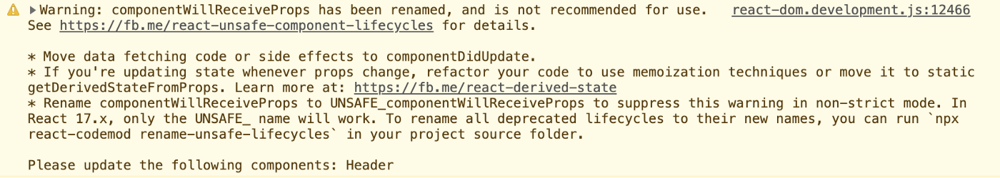
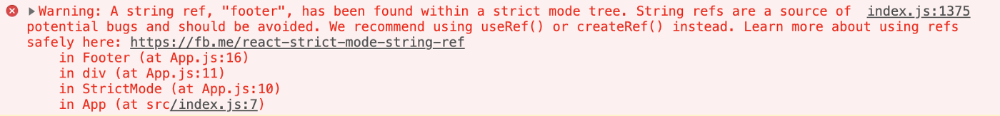
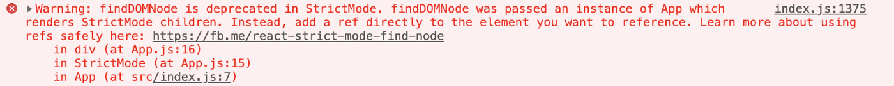
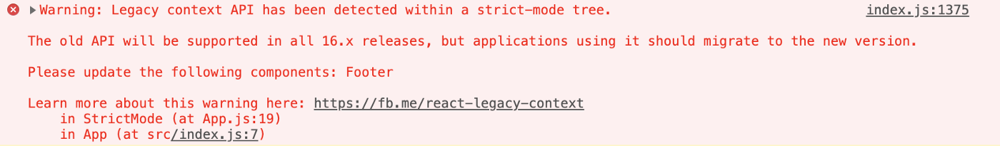

> **TL;DR** — *StrictMode is a feature added in version 16.3 and aimed to help us in finding potential problems in an application, at the moment especially for Concurrent-Mode which is React’s ability to concurrently render, suspend, and resume rendering trees in the background while remaining interactive.*

Last month on twitter, I encountered a tweet by [Sebastian Markbåge](https://twitter.com/sebmarkbage) a React core team member asking developers if their app is running in `<StrictMode>`:

The results blew my mind, 70% of us aren’t using it and never tried it!  
At the moment, `StrictMode` helps us adapt our app to ⚡ Concurrent React ⚡ (Will be covered soon).  
With [React-Conf](https://conf.reactjs.org/) just around the corner (24–25/10), we still don’t know what the keynote by [Tom Occhino](https://twitter.com/tomocchino) and [Yuzhi Zheng](https://twitter.com/yuzhiz) will be about, it looks like Concurrent mode might arrive sooner than we thought.

In this post I’ll cover all the warnings produced when using `StrictMode`, how they are related to Concurrent React and what actually is Concurrent React.  
I promise you that by the end of this post, you’ll probably want to add it to your react app 🙂

## What is it?
React `StrictMode` is a feature added in version 16.3 and aimed to help us in finding potential problems in an application.  
If you see warnings in `StrictMode`, you will likely encounter bugs when trying to use Concurrent React.

Like `Fragment`, `StrictMode` does not render any UI, it only activates checks and adds warnings at runtime.  
`StrictMode` checks are done in development mode only and will **not** affect your production build.

## Whats the motivation?
Concurrent React is React’s new ability to concurrently render, suspend, and resume rendering trees in the background while remaining interactive (not destroying old trees while rendering the next).  
Concurrent React’s main features are Time Slicing and a new Scheduler mechanism but it may also come with more features like React Suspense (for asynchronous data fetching) and Caching.

We know that Facebook are [dogfooding](https://en.wikipedia.org/wiki/Eating_your_own_dog_food) Concurrent React for a while now in the new Facebook web (discovered in F8), iterating on bugs and working to get a stable version.

Just so you’ll get a glance of Concurrent mode’s power, an unstable example of Time-slicing was shown by [Dan Abramov](https://twitter.com/dan_abramov) in his talk [“Beyond React 16”](https://www.youtube.com/watch?v=nLF0n9SACd4&vl=en) and can be found [here](https://timeslicing-unstable-demo.surge.sh/).  
The example above shows Time slicing and scheduling, using it in Synchronous mode is the way React works now and using it in Asynchronous mode is an unstable example of Concurrent mode.

Concurrent mode is actually a different paradigm than the way we wrote JavaScript up until now, we should think of it more as a multi-threaded model, which schedules our work on a priority base.  
As this paradigm is different, we need time and practice to get rid of old bad habits, trying out `StrictMode` is a great way to start.

## How to use it?
All you need to do in order to enable `StrictMode` (from version 16.3) is to wrap the part you want in your app with `<React.StrictMode>`.  
You can wrap the whole app or only specific nodes.  
Here’s an example of wrapping the whole app:

```jsx
function App() {
    return (
        <React.StrictMode>
            <div className="App">
                <Header />
                <div>
                    Page Content
                </div>
                <Footer />
            </div>
        </React.StrictMode>
    );
}
```

Right after doing that you’ll be able to see warnings in your developer tools console.  
At the moment, `StrictMode` helps with a few specific issues, we’ll cover them up and see how the warnings look like.

## Detecting unexpected side effects:
Conceptually, React works in two phases, the **Render phase** and the **Commit phase**.  
The **render phase** is the expensive part, it’s when React decides what changes need to be made to the DOM. In this phase, React will call your render function and run a render lifecycle which includes: `constructor`, `componentWillMount`, `componentWillReceiveProps`, `componentWillUpdate`, `getDerivedStateFromProps`, `shouldComponentUpdate`, `render`, `setState` updater functions.  
The **commit phase** is the part when React flushes the changes (additions, updates, removals) to the DOM, usually a quick phase. In this phase React also calls the `componentDidMount` and `componentDidUpdate` lifecycles.

While these phases will probably stay the same in Concurrent mode, the plan is to break the render phase into small pieces so we will be able to pause and resume the render phase so we won’t block the browser with long renders.  
In fact, this means that React may trigger a render lifecycle more than once before committing the changes or even trigger a render without committing it (for example an error was caught or a higher order event happened).  
So we can understand that the lifecycles in the render phase can be called more than one time, therefore it’s important that they will not contain side effects, if they will contain side effects, it may cause memory leaks and invalid state.

In order to help with that, in development mode only, `StrictMode` will double invoke the next methods from the lifecycle: `constructor`, `render`, `setState` updater function and `getDerivedStateFromProps` so you will be able to see if your code breaks or behaves different than how you expected.

##  Identifying components with unsafe lifecycles
The ‘Unsafe Lifecycles’ term was introduced in release 16.3 of React, it means that some of the legacy component lifecycles tend to encourage unsafe coding practices, they were misunderstood and misused in codebases. The main issue is that their potential misuse may be even more problematic for concurrent react (creating side-effects in places that aren’t made for that may cause problems when updating them concurrently). That’s why `componentWillMount`, `componentWillReceiveProps` and `componentWillUpdate` were all flagged with `UNSAFE_` prefix.  
In `StrictMode` you will get a list of every component that still uses these lifecycles, that comes in handy to ensure that a third party library isn’t using these lifecycles.

Using unsafe lifecycles will produce this warning:



To help with refactoring your own code, there’s a code-mod that will rename all unsafe lifecycles and add the `UNSAFE_` prefix, though keep in mind that this only removes the warning, it doesn’t remove the use of an unsafe lifecycle.

```
npx react-codemod rename-unsafe-lifecycles <path>
```

## Warning about legacy string ref API usage:
Although being the convenient way, legacy string refs have several downsides. The main one was that they were resolved synchronously, which means they will create a problem when rendering will happen concurrently.  
To fix this warning you have two options:  
From version 16.3, Using [createRef](https://reactjs.org/docs/react-api.html#reactcreateref) is the recommended way to create refs.

```jsx
class App extends React.Component {
    constructor(props){
        super(props);
        this.containerRef = React.createRef();
    }
    render() {
        return (
            <div ref={this.containerRef}>
                My App
            </div>
        );
    }
}
```

If you’re using an older version, the recommended way is a [callback ref](https://reactjs.org/docs/refs-and-the-dom.html#callback-refs) to make the ref creation “asynchronous”.

Lastly, you can also refactor your component to use [Hooks](https://reactjs.org/docs/hooks-intro.html), and use the [useRef](https://reactjs.org/docs/hooks-reference.html#useref) hook.

Using string refs will produce this warning:



## Warning about deprecated findDOMNode usage:
React used to support `findDOMNode` to search the tree for a DOM node given a class instance.  
There are a few problems with this approach, the first one is that it might cause an issue with refactoring since a parent component used to be aware of it’s children implementation details if it used `findDOMNode` to get a child element, The second problem is that `findDOMNode` returns the first child found, but in a world with `Fragments` we sometimes have multiple children rendered by one component.  
Using `findDOMNode` is usually unnecessary since you can always create a ref directly to a DOM node (as we showed previously), if you do need something like `findDOMNode`, you can create a ref and use [Ref Forwarding](https://reactjs.org/docs/forwarding-refs.html#forwarding-refs-to-dom-components) in your custom component in order to get the underlying DOM element.

Using deprecated `findDOMNode` will produce this warning:



## Detecting legacy context API:
This isn’t Concurrent mode related issue but still addressed within `StrictMode`. React previously shipped with an experimental context API which was error-prone, and will be removed in a future major version. It still works for all 16.x releases but if you’re using it you should migrate to the new Context API.

Using legacy context API will produce this warning:



## Summing it up:
In this post we covered all the warning you’ll get when using `StrictMode` but the main issue isn’t really about `StrictMode`, it’s more about getting rid of old habits that will keep us from not using Concurrent mode when it becomes available (hopefully on 24/10 🤞).  
Some users may still be blocked from fixing all the changes I’ve covered here like developers using `componentWillMount` for server side rendering. These issues will probably be addressed by the React team if weren’t addressed already when implementing Concurrent mode in the new facebook.  
Another type of users that may be blocked are developers still using legacy 3rd party packages, in that case I recommend upgrading packages or replacing them with new ones since they probably aren’t maintained anymore.

Hope I convinced you to add `StrictMode` to your app and that you’ve realised what’s coming up for us as React users.  
If you have any questions, feel free to ask.  
I’m available on [twitter](https://twitter.com/matanbobi).  
Thanks for reading!